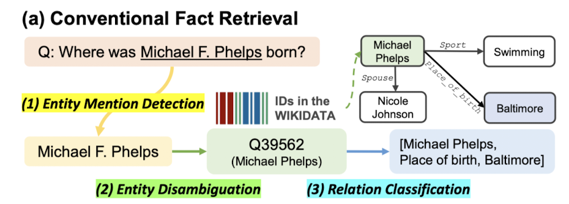

# Direct Fact Retrieval from Knowledge Graphs without Entity Linking

Publish: ACL
Date: 2023
Link: https://arxiv.org/abs/2305.12416
status: Done

# Introduction

Knowledge graph는 (head entity, relation, tail entity) triplet 구조로 표현된 fact들의 집합으로 구성되어있다. 이러한 Knowledge graph는 매우 많은 양의 world knowledge를 담을 수 있다.

또한, 최근 Language model들이 많이 사용되고 있는데, 이러한 LM의 knowledge는 parameter 속에 담겨있다(parametic knowledge). 그러나, 이러한 parametic knowledge는 불완전하고, 정확하지 않으며, knowledge를 업데이트 하기 어렵다는 한계가 존재한다.

이러한 한계를 극복하기 위해, 최근 **LM에 KG로부터의 fact(knowledge)를 추가**하는 연구들이 진행되고 있다. 

그러나, 현재까지의 KG로부터 fact를 retrieve하는 방법론들은 대부분 불필요하게 복잡하다. 해당 방법론들은 3개의 sequential step들을 사용하는데, 이는 아래와 같다.

- Span detection
- Entity disambiguation
- Relation classification

이 과정을 figure로 나타내보면 아래와 같다

1. Input text(question)가 주어졌을 때, 그 안에서 span of entity를 찾아낸다
2. 찾아낸 input 속의 entity mention과 KG 안의 entity id를 match한다
3. Matching된 KG 속 entity와 연관된 relation중에서, 가장 알맞은 relation을 골라 answer 산출

위와 같은 방법론에는 아래와 같은 문제점이 존재한다

- 각 sub-task의 module을 학습하기 위해 query-triplet data말고도 module-specific label이 필요함
  
    → 현실적으로, label된 high-quality data는 얼마 존재하지 않음
    
- Error propagation하기 쉽다
  
    → 예를 들어, span detection 단계에서 잘못된 detection을 수행해버리면 그 이후로도 계속 잘못된 task를 수행하게 된다
    
- 하나의 KG에 대해 훈련된 pipeline(match entity module, predict relation module)은 다른 KG에 적용할 수 없다
  
    → 만약, 다른 KG에서 기존 KG에 없는 entity가 존재한다면 정상적으로 작동할 수 없다
    

이러한 문제를 해결하기 위해, 본 논문에서는 natural language query와 관련이 있는 relavant triplet을 직접 retrieve하는 방법론을 제안한다. 이는 natural language query와 triplet을 shared representation space 상에서 similarity를 구하는 방법으로 진행한다. 아래는 해당 방법론을 나타내는 figure이다.

저자들은 이러한 direct retrieval framework에 대해, ODQA with document 관련 연구들에서 영감을 받았다고 한다(DPR paper)

그러나, embedding할 충분한 context가 존재하는 document와는 다르게, KG의 경우 retrieve하는 대상이 short triplet이기에, 저자들은 이러한 방식으로 retrieve한 triplet이 LM의 성능에 좋은 영향을 미칠지는 불분명하다고 밝힌다.

retriever를 구축하기 위해, 본 논문에서는 유사한 input text와 triplet의 representation끼리 similarity를 최대화하는 방향으로 retriever를 학습하였고, 유사하지 않은 경우에는 similarity를 최소화하는 방향으로 학습하였다고 한다. 이때, 각각의 representation을 encoding하기 위해 LM을 사용했다고 하며, 기존 fact retrieval 방법론들과 다르게 extra label 없이 오로지 text triplet만을 사용했다고 한다

이후, FAISS index를 통해 encoded representation of triplet들을 indexing하고, query(input text)의 representation과 비교하여 similarity가 높은 triplet을 output으로 산출한다.

본 연구에서 제안하는 방법론은, 기존 방법론들이 KG schema(distinct entities and relation types)를 추가적으로 학습해야 했던것과는 달리(TF-IDF 사용) LM을 사용하였기 때문에 별다른 수정 없이 다른 KG에 대해서도 generalize가 가능하다는 장점이 존재한다고 한다

본 논문에서는 새로운 방법론의 이름을 Direct Fact Retrieval(DiFaR)라고 명명한다

저자들은 실험을 통해 direct retrieval on KG가 잘 작동한다는 것을 입증했지만, 위에서 잠깐 언급했듯이 triplet form에 담긴 fact는 제한된 양의 context를 가지고 있기에, input text representation과 triplet representation의 유사도 계산은 간단하지만 효과적이지 못할 수 있다고 지적한다.

그래서, 이러한 문제를 해결하기 위해 reranker를 사용한다고 밝힌다. 이러한 reranker는 retrieve된 top-k개의 triplet의 rank를 재조정하는 역할을 수행한다. 아래의 figure는 이러한 retrieve-rerank 과정을 나타낸 figure이다

이러한 Reranker는 rank를 재조정하는 역할을 수행하며, input text와 관련이 없는 triplet을 걸러내는 역할을 한다. (위에서 언급했듯이, triplet 내부에는 제한된 context가 포함되어있기에, retriever에서 잘못 retrieve했을 경우에 reranker에서 걸러주는 역할을 수행하는 것이다)

이러한 filter역할을 잘 수행하게끔 하기 위해, 저자들은 reranker를 학습시킬 때 input text representation과 이와 가깝지만 관련이 없는 triplet representation 사이의 similarity를 최소화하는 방향으로 학습시켰다고 한다.

지금까지의 내용을 정리해보면 아래와 같다

- 기존 방법론들의 3-step을 representational similarity만 이용하는 방법으로 간단화한 direct fact retrieval 방법론인 DiFaR을 제안함
- DiFaR는 rerank strategy를 사용하여 triplet의 limited fact context를 해결하고자 함
- 이러한 DiFaR는 fact retrieval task들에서 우수한 성능을 보임

# DiFaR: Direct Fact Retrieval

본 논문에서 제시하는 DiFaR framework를 소개하기에 앞서, KG(Knowledge Graph) 및 위에서 언급했던 기존 방법론에 대해 짚고 넘어가보자

## Knowledge Graph

Knowledge graph는 factual triplet들의 집합으로 구성되어있으며, 하나의 factual triplet은 (head entity, relation, tail entity)로 구성되어있다

본 논문에서 이를 나타내는 notation은 아래와 같이 정의된다

- $\mathcal{E}$  : set of entity
- $\mathcal{R}$ : set of relations
- factual triplet : $t = (e_h, r, e_t) \in \mathcal{E} \times \mathcal{R} \times \mathcal{E}$
  
    → $e_h$ : head entity,
    → $e_t$ : tail entity
    → $r$ : relation
    
- KG = $\mathcal{R} = \{(e_h, r, e_t)\} \subseteq \mathcal{E} \times \mathcal{R} \times \mathcal{E}$

이러한 KG는 넓은 범위의 useful한 knowledge를 담고 있으며, QA, dialogue system과 같은 다양한 task에 적용시키려는 연구들이 진행되어 왔다.

그러나, KG의 fact에 접근하는 기존 방법론들은 너무 복잡하다는 문제점이 있으며, 이러한 이유로 다양한 범위에 적용되기엔 한계가 존재했다.

## Existing Knowledge Graph Retrieval

이제부터는 그 기존 방법론에 대해 알아보도록 하겠다.

우선, notation은 아래와 같다

- $x = [w_1,w_2 \dots w_{|x|}]$ : input text(sequence of tokens)
- $t^+$ : target triplet to retrieve

기존 방법론이 $t^+$ 를 산출하는 과정은 아래와 같은 수식으로 표현 가능하다

$$
t^+ = \text{argmax}_{t \in \mathcal{G}}p_{\theta}(t|e,x,\mathcal{G})p_{\phi}(e|m,x)p_{\psi}(m|x)
$$

해당 수식에서, 각각의 요소들은 다음과 같은 의미를 가진다

- $p_{\psi}(m|x)$ : model for mention detection
  
    → $m$ : mention within the input $x$
    
- $p_{\phi}(e|m,x)$ : model for the entity disambiguation
- $p_{\theta}(t|e,x,\mathcal{G})$ : model for the relation classification

또한, 위의 model들은 각각 $\psi, \phi, \theta$로 parameterize된다

이러한 기존 3-step 방법론은 아래와 같은 한계점을 가진다

1. accumulation of error
2. difficult to train end-to-end fashion
3. 각각의 sub-module들을 학습시키기 위해 input-triplet pair뿐만 아니라 $(x, m)$와 같은 additional label이 필요함
4. 특정 KG의 schema에만 작동하게끔 학습되어, unseen entity, relation에 적용할 수 없음

## Direct Knowledge Graph Retrieval

이러한 문제를 극복하기 위해,저자들은 direct knowledge retrieval framework를 제안한다

해당 framework는  $t^+$ 를 산출하기 위해 single sentence encoder $E_{\theta}$를 사용하며, 아래와 같은 수식으로 표현 가능하다

$$
t^+ = \text{argmax}_{t \in \mathcal{G}}f(E_{\theta}(x),E_{\theta}(t))
$$

해당 수식에서, 각각의 요소들은 다음과 같은 의미를 가진다

- $f$ : non-parametic scoring function
  
    → calculate the similarity between the input text representation $E_{\theta}(x)$ and triplet representation $E_{\theta}(t)$
    

triplet representation $E_{\theta}(t)$를 산출해내기 위해, triplet을 $t = [w_1, w_2, \dots, w_t]$와 같은 sequence of tokens의 형태로 변형시킨다.

이때, 각 entity와 relation 사이에는 [SEP] token을 넣어 준다. 이를 예시와 함께 살펴보면 아래와 같다

> Triplet = (head entity, relation, tail entity)
triplet as sequence of tokens
→ (head entity’s tokens [SEP] relation’s tokens [SEP] tail entity’s tokens)
> 

이렇게 생성된 triplet as sequence of tokens를 $E_{\theta}$에 넣어주어 triplet representation을 얻게 된다

또한, 본 연구에서는 input text representation과 triplet representation을 얻는 encoder를 공유했다고 한다

이 과정을 figure로 나타내면 아래와 같다

또한, 이 과정을 예시와 함께 나타낸 figure는 아래와 같다

### Training

그렇다면, 이러한 direct knowledge retrieval framework(DiFaR)는 어떻게 학습시킬까?

우선, DiFaR framework가 잘 작동하기 위해서는, embedding space에서 input text와 relevant triplet의 거리는 가깝게 하고, irrelevant triplet과의 거리는 멀리 위치하게끔 해야한다.

즉, input text와 triplet을 embedding space로 보내주는 $E_{\theta}$를 위 목적을 잘 수행하게끔 학습시킨다는 의미이다.

저자들은 이를 위해 DPR 논문에서 제안된 contrastive loss를 사용하였고, 이는 아래와 같다

$$
\min_{\theta}-\log{\frac{\exp(f(E_{\theta}(x), E_{\theta}(t^+)))}{\sum_{(x,t)\in \tau}\exp(f(E_{\theta}(x), E_{\theta}(t)))}}
$$

해당 수식에서, 각각의 요소들은 다음과 같은 의미를 가진다

- $\tau$ : 하나의 batch안에 있는 input text와 triplet의 pair set
  
    → $(x, t^+) \in \tau$의 경우, similarity를 극대화해야하는 positive pair
    → 그 밖의 pair는 similarity를 최소화해야하는 negative pair
    

### Inference

추론 시에는, input text $x$가 주어지면, relevant triplet들을 반환해줘야하는데, 이 과정이 $E_{\theta}$를 통한 representation의 비교로 수행된다. 논문에서는 효과적인 추론을 위해, triplet의 representation을 미리 구해놓고, 이에 대해 FAISS index를 구축하여 효과적으로 추론을 진행한다고 밝힌다.

추가적으로, Hierarchical Navigable Small World Search with Scalar Quantizer로 불리는 approximated neighborhood search algorithm을 사용하였다고 한다. 이를 통해 메모리 사용과 nearest neighborhood search를 효과적으로 할 수 있었다고 한다.

## Reranking for Accurate Fact Retrieval

지금까지의 과정은 KG로부터 fact를 retrieve하는 과정이었다. 그러나, 저자들은 KG에 담긴 fact는 triplet 형태이며, 이는 오로지 2개의 entity와 1개의 relation으로만 구성되어 context가 부족하다는 점을 지적한다. 

또한, LM augmented일 경우에, 만약  top-k개의 triplet을 retrieve한다고 가정하면, LM에 k번만큼 text를 통과시켜야 한다. 그런데 이는 매우 많은 computational cost를 필요로 하기에 k값을 작게 유지하되, 정확한 k개의 triplet을 가져오는 것이 중요하다고 지적한다.

저자들은 이러한 문제를 해결하기 위해 retrieve된 triplet의 rank를 재조정하는, 추가적인 rerank 과정을 제안한다.

rerank 과정에서는, retrieve 과정에서 사용했던 것과 별개의 LM을 사용한다. ($E_{\phi}$)

또한, retrieve 과정에서 input과 triplet의 representation이 각각 별개로 생성된 이후 두 representation을 비교한 것과는 달리, rerank에서는 input text와 triplet을 concat한 이후, concatenated token sequence를 한번에 LM에 넣어 유사도를 구한다

이 과정을 figure로 나타내면 아래와 같다

논문에서는 이러한 과정이 input text와 triplet 간 token-level relationship을 효과적으로 포착하여 retrieved triplets들의 rank calibration이 더 정확하게 이루어진다고 주장한다

reranker LM training의 경우, 기본적으로 retriever와 동일하게 relevant triplet의 거리는 가깝게 하고, irrelevant triplet과의 거리는 멀리 위치하게끔 학습시킨다.

다만, loss function은 contrastive loss를 사용하진 않는다. retriever와는 다르게 reranker의 output은 similarity, 즉 스칼라값으로 나오게 된다. 여기에 sigmoid를 적용시킨 후 binary cross entropy를 loss function으로 하여 학습을 진행한다.

negative sampling의 경우, reranker의 목적이 retriever에서 retrieve한 triplet들 중에서, input text와 irrelevant하지만 k-nearest neighbor에 속해있는 confusing example을 filtering하는 것이기에 negative sampling 시에 retrieve된 triplet 중 ground truth triplet을 제외한 나머지 triplet을 negative sample로 넣어준다.

이를 통해, retrieve된 triplet 중에서도 irrelevant한 triplet들에 대해 잘 filtering할 수 있게 학습이 진행된다

저자들은 이러한 rerank가 추가된 framework에 대해 Direct Fact Retrieval with Reranking(DiFaR²)라고 명명한다

# Experimental Setups

저자들은 본 논문에서 제안하는 DiFaR과 DiFaR²의 성능을 측정하기 위해 여러 실험을 진행하였다. 결과를 살펴보기 전에, 실험이 어떠한 setup에서 이루어졌는지 확인해보자

## Datasets

먼저, 저자들은 DiFaR framework에 대한 성능 측정을 fact retrieval task로 진행하였다. Fact retrieval task란, query와 relevant한 triplet들을 retrieve하는 task이다.

본 논문에서는 QA task dataset, dialogue dataset으로부터 기인한 총 4개의 dataset을 사용하였다

### Question Answering

KG-based question answering task는 input으로 question이 주어지면, 그에 대한 direct answer가 될 수 있는 factual triplet을 KG로부터 retrieve하는 것을 목적으로 한다.

이 task를 위해, 저자들은 아래의 dataset들을 사용하였다.

- SimpleQuestions
- WebQuestionsSP
- Mintaka

해당 dataset들의 경우, SimpleQuestions와 WebQuestionsSP은 Freebase KG 기반으로 제작되었으며, Mintaka는 wikidata KG 기반으로 제작되었다.

### Dialogue

QA task에 더해, 본 논문에서는 conversation query에 대한 응답으로, factual knowledge를 줄 수 있는 relevant triplet을 retrieve함을 subtask로 가지는 KG-based dialogue generation task에 대해서도 성능 측정을 진행하였다. 

이에 사용된 dataset은 OpenDialKG dataset이며, 해당 dataset은 Freebase KG를 기반으로 제작되었다.

### Knowledge Graphs

본 논문에서는,  retrieve의 대상인 KG를 QA dataset에 대해서는 wikidata KG를 사용하였고, OpenDialKG dataset에 대해서는 Freebase KG를 사용하였다고 한다.

그런데, 위에서 잠깐 언급했지만, SimpleQuestions와 WebQuestionsSP은 Freebase KG 기반으로 제작되었는데, wikidata KG를 사용한다.

이 점에 대해서, 논문에서는 appendix에서 좀 더 자세한 이야기를 한다

Freebase KG의 경우, 더 이상 공식적으로 지원하지 않는다. 따라서 최근에 제안된 entity linking model들의 경우, Wikidata KG 기반으로 고안되어서 Freebase KG에 적합하지 않다.

이러한 이유로, Freebase KG 기반으로 제작된 dataset들을 이용하기 위해 저자들은 Freebase KG에서 Wikidata KG로 mapping된 dataset들을 사용했다고 밝힌다.

즉, SimpleQuestions dataset의 경우, wikidata-SimpleQuestions dataset을 사용한 것이다.

그러나, OpenDialKG dataset의 경우 여전히 Freebase KG를 사용한다. 저자들은 이러한 setup의 이유에 대해, 다른 dataset들과는 달리 OpenDialKG dataset은 Freebase entity id를 제공하지 않아 wikidata KG로의 mapping이 불가능해서 이러한 setup을 구성했다고 밝힌다.

## Baselines and Our Models

위에서 언급한 dataset들을 통해, DiFaR과 DiFaR²을 다양한 model들과 성능 비교를 진행하였다.

### Retrieval with Entity Linking

해당 model들은 entity linking 방법론을 사용하여 identified된 entity들과 연관된 relation을 candidate으로 예측하는 model들이다. 본 논문의 실험에서는 아래와 같은 model들이 사용되었다.

- Retrieval with spaCy
- Retrieval with GENRE
- Retrieval with BLINK
- Retrieval with ReFinED

### Factoid QA by Retrieval

해당 model은 entity들과 relation을 input quert와의 유사도를 기반으로 각각 독립적으로 retrieve하는 model이다.

### Our Models

본 논문에서 소개한 DiFaR과 DiFaR² 이다

### Retrieval with Gold Entities

labeled entity를 input으로 넣어준 뒤, 이와 관련있는 triplet을 retrieve하는 setting이다. Label된 gold entity를 input으로 넣어주기에 매우 성능이 좋을 수밖엔 없고, 저자들도 해당 model은 다른 model들과 비교하진 않았다고 한다

## Evaluation Metrics

본 논문에서는 위에서 언급한 dataset들로 model의 성능을 측정할 때, 아래의 metric들을 사용했다고 한다

- Hits@K : top-k개의 triplet 중, correct answer를 포함하고 있으면 True
- Mean Reciprocal Rank(MRR) : 첫 번째 correct triplet의 rank를 측정한 뒤, rank의 역수에 대해 평균을 내는 것이다.

추가적으로, MRR을 측정할 때는 k=1000으로 두어 top-1000 retrieve triplet 중에서 측정했다고 한다

## Implementation Details

Retriever로는 MSMARCO dataset으로 학습시킨 distilbert(66M parameters)를 사용하였고, reranker로는 마찬가지로 MSMARCO dataset으로 학습시킨 MiniLM(22M parameters) model을 사용했다고 한다

Reranking을 진행하는 동안, top-100 triplet을 retriever로부터 받아서 reranking을 진행했다고 한다

또한, 추후에 결과표에서 unsupervised setting과 supervised setting이라는 용어가 등장하는데, 여기서의 해당 용어들은 단순히 지도학습, 비지도학습이 아니라 아래의 뜻을 가진다

- Supervised : 각 dataset의 training set으로 추가 학습 진행
- Unsupervised : 추가 학습을 진행하지 않음

이때, 추가 학습은 아래와 같은 configuration으로 진행하였다

- 30 epochs
- batch size : 512(QA), 32(dialogue)
- learning rate : 2e-5
- AdamW optimizer
- RTX 2080 Ti, Xeon(R) Gold 6240 72core, takes less than 1 day

# Experimental Results and Analyses

지금부터는 해당 실험에 대한 결과와 결과에 대한 분석을 다룬다

### Main results

먼저, QA dataset에 대한 결과이다

우선, DiFaR과 DiFaR²가 supervised와 unsupervised setting 모두에서 기존 방법론 대비 좋은 성능을 보였으며, 특히 DiFaR²의 경우에는 모든 dataset에서 가장 좋은 성능을 보임을 확인할 수 있다

dialogue dataset(OpenDialKG)에서는 어떨까? 아래 결과 table을 보자

QA dataset들에서의 결과와 마찬가지로, DiFaR과 DiFaR²가 supervised와 unsupervised setting 모두에서 기존 방법론 대비 좋은 성능을 보였으며, DiFaR²가 가장 좋은 성능을 내는 것을 확인할 수 있다

저자들은 reranking strategy로부터 기인하는 성능 향상을 확인하기 위해, DiFaR과 DiFaR²를 비교해보았다.

우선, 앞선 result table들에서 볼 수 있었던것처럼 reranking strategy를 적용한 DiFaR²는 성능 향상을 이끌어냄을 확인할 수 있었다. 특히, mintaka와 OpenDialKG와 같이 challenging dataset들에서도 높은 수준의 성능 향상을 이끌어냈다.

그러나, reranking strategy가 적용되지 않은 DiFaR에서도 충분히 좋은 성능을 확인할 수 있었으며, SimpleQuestions dataset에서의 Factoid QA by Retrieval setting을 제외하면 모든 기존 방법론보다 좋은 성능을 냈다

또한, 저자들은 SimpleQuestions에서의 DiFaR 성능 하락의 원인으로, SimpleQuestions dataset의 경우 question에서 entity를 추출하고 relation을 예측하는것이 매우 간단하기 때문임을 지목한다
→ 이 부분에 대해 추가적 조사 필요

SimpleQuestions dataset에서 성능이 뒤쳐진것과 별개로, DiFaR Framework는 Retrieval with Gold Entities setup보다 더 좋은 성능을 보일 때도 있었다.

### Analyses on Zero-Shot Generalization

저자들은 DiFaR framework가 같은 KG로부터 기인한 다른 dataset들에도 적용될 수 있으며, 심지어는 다른 KG에도 수정 없이 바로 적용이 가능하다고 말한다.

이에 대한 이유로, DiFaR는 기존의 entity linking 방법론과는 달리, 특정한 entity나 relation schema를 활용하는 것이 아닌, text-level의 유사도를 이용하여 triplet을 retrieve하기 때문이다.

본 논문에서는 이를 입증하기 위해 zero-shot transfer learning 실험을 진행하였고, setting은 아래와 같다.

- WebQSP dataset + Wikidata KG로 model 학습
- Different dataset with same KG로 성능 측정
    - SimpleQuestions + Wikidata KG
    - Mintaka + Wikidata KG
- Same dataset with different KG로 성능 측정
    - WebQSP + Freebase KG

이에 대한 결과는 아래와 같다

DiFaR의 경우, dataset과 KG가 달라져도 기존 entity linking을 사용하는 방법론들에 비해 generalize한 성능을 내는 것을 확인할 수 있다.

### Analyses on Single and Multi hops

Multi-hop retrieval이란, input query와 직접적으로 연관이 있지 않은 entity를 retrieve하는 것을 필요로 하는 task이다.

DiFaR의 경우, input query에 존재하는 entity에만 의존하지 않고 retrieve를 하기 때문에 single-hop이든 multi-hop이든 direct하게 retrieve할 수 있다.

그렇다면, DiFaR는 어떻게 multi-hop이 필요한 complex query를 direct하게 다룰 수 있을까?

아래는 multi-hop이 필요한 complex query의 예시이다.

우선, 첫 번째 예제부터 살펴보자. us president in 1963 → Robert F. Kennedy → religion → Catholicism 과 같은 과정을 통해 answer를 산출해야하는 문제이다. DiFaR는 별다른 추가 과정 없이 Catholicism이라는 answer를 바로 산출해낼 수 있었다.

저자들은 이러한 현상에 대해 DiFaR는 input query와 triplet을 encoding할 때 LM을 사용하는데, 이 LM이 pre-training 과정을 거치며 background knowledge를 얻게 되고, 이를 이용하여 complex question도 directly retrieve할 수 있었던 것이라고 추측한다.

첫 번째 예제를 통해 이야기해보자면, LM이 pre-training 과정에서 us president in 1963가 Robert F. Kennedy 라는 사실을 이미 알게 되었고, 이러한 knowledge를 통해 별다른 과정 없이 Catholicism을 바로 retrieve할 수 있게 되었다는 것이다.

저자들은 single hop과 multi hop에 대한 비교 실험 역시 진행하였으며, 실험 결과는 아래와 같다

우선, 앞선 결과들과 같이 DiFaR²의 reranking strategy는 single hop과 multi hop 모두에서 상당한 성능 향상을 불러일으킨다는 점을 확인할 수 있다.

그러나, 전반적으로 multi hop에 대한 성능은 매우 낮은 것을 확인할 수 있다. 따라서, 이러한 multi-hop에서의 성능 향상이 향후 연구들에서 진행되어야 할 것으로 보인다.

### Analyses on Reranking with Varying K

앞선 결과들로부터 reranking strategy가 매우 큰 성능 향상을 보인 것을 확인할 수 있었다. 저자들은 이러한 reranking strategy를 사용할 때, 몇 개의 triplet에 대해 reranking을 진행하는 것이 가장 효과적인지를 확인하기 위해 실험을 진행하였다. 결과는 아래와 같다

모든 dataset들에서, K=10일때까지는 성능 향상의 폭이 가파르다가 10이상부터는 완만해지는 것을 확인할 수 있다. 또한, K의 값이 높아질수록 retrieve에 소요되는 시간은 linear하게 증가한다.

따라서 저자들은 K값을 10정도로 설정하는 것이 가장 효율적인 값이라 제안한다

### Sensitivity Analyses on Architectures

저자들은 retriever와 reranker의 architecture를 다르게 하는 것이 성능에 어떠한 영향을 미치는지 알아보기 위해 실험을 진행하였다

MSMARCO dataset으로 pre-training한 architecture가 가장 좋은 성능을 내는것을 확인할 수 있다. 이어서, MSMARCO dataset으로 pre-training한 경우에는 model이 달라도 비슷한 성능을 내는 것을 확인할 수 있다

저자들은 이러한 결과에 대해, document retrieval로 얻어진 knowledge도 fact retrieval 성능에 좋은 영향을 주며, DiFaR framework가 다른 backbone들에 대해서도 robust하다고 주장한다

### Analyses on Entity Linking

저자들은 DiFaR의 경우, entity linking에 대해 별도의 과정을 통해 학습하지 않았지만, 전체 학습 과정에서 entity linking을 할 수 있는 knowledge를 학습하였을 것이라 추측한다. 이를 확인해보기 위해 실험을 진행하였다. 실험에 대한 성능 측정은 retrieved triplet에 labeled entity가 포함되어있는지의 유무로 진행되었다

결과는 아래와 같다

DiFaR가 기존 entity linking 방법론들에 비해 월등한 성능을 보임을 확인할 수 있다.