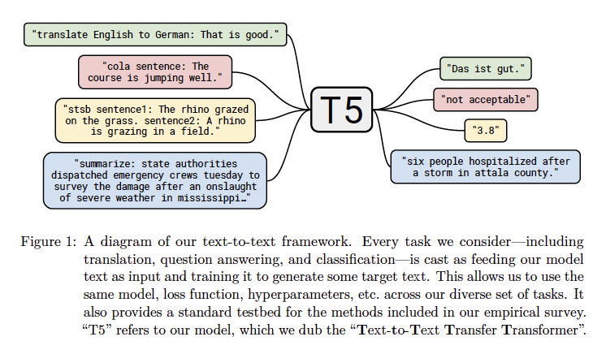
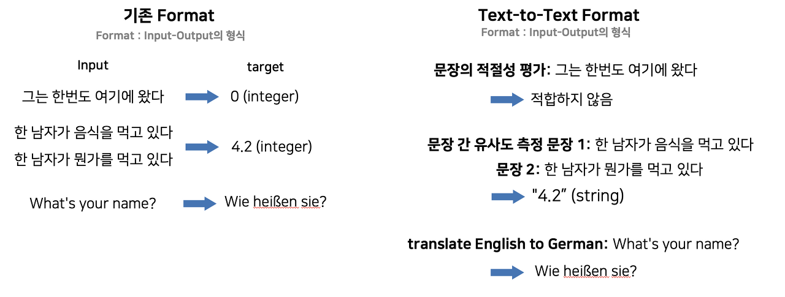
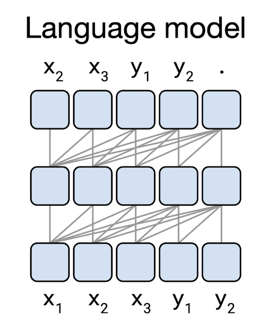
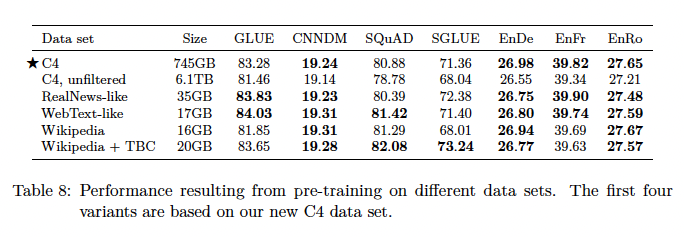

# Exploring the Limits of Transfer Learning with a Unified Text-to-Text Transformer

이번 게시물에서는 구글에서 연구하고 발표한 T5를 다룬 논문인 Exploring the Limits of Transfer Learning with a Unified Text-to-Text Transformer에 대해 다뤄보겠다. 해당 모델의 경우, BART와 같이 Encoder-Decoder 구조를 지니고 있으며, 모든 task에 대해 text-to-text task로 다룬다는 특징을 가지고 있다. 이에 대한 자세한 내용은 아래에서 다루도록 하겠다.

또한, 논문의 양이 매우 긴 편인데(Appendix와 Reference를 제외하고도 40페이지 남짓), 저자들이 T5를 연구하면서 진행한 가설 설정 및 비교 실험을 모두 담아놓았기 때문에 그렇다. 처음부터 차근차근 따라가면 NLP에서의 language model에 대한 전반적인 insight와 저자들이 왜 이러한 구조로 모델을 구성했는지에 대한 내용을 습득할 수 있기에, 개인적으로는 시간을 들여서 차근차근 처음부터 쭉 보는 것을 추천한다.

원문 링크는 다음과 같다.

[Exploring the Limits of Transfer Learning with a Unified Text-to-Text Transformer](https://arxiv.org/abs/1910.10683)

## **Introduction**

NLP task에서, 모델이 downstream task에서 text를 잘 처리할 수 있게끔 하는 것은 모델이 text를 잘 이해할 수 있도록 하게 해주는 범용적인 지식을 개발하는 것으로도 볼 수 있다.

최근 연구들에서는, 언어 모델에 pre-training을 적용함으로써 downstream task까지 전이될 수 있는 general purpose ability와 knowledge를 가지게끔 한다. CV 분야에서의 pre-training은 일반적으로 supervised learning으로 진행되는 것과 달리, NLP에서의 pre-training은 unsupervised learning을 통해 진행된다. 이렇게 unsupervised learning으로 pre-training 된 모델들은(BERT, GPT, XLNET) 다양한 NLP task를 포함한 benchmark에서 SOTA를 달성해 왔다.

또한, unsupervised pre-training에 사용되는 unlabeled text data의 경우, 인터넷을 통해 상당한 양을 구할 수 있다. 예를 들어, Common Crawl project는 매 달 20TB 분량의 text data를 webpage로부터 추출한다.

이러한 상당수의 data와 unsupervised pre-training의 시너지 효과로 인해, 효과적인 pre-training objective에 대한 연구와 같이 NLP에서의 transfer learning을 발전시키는 연구들이 활발히 진행되고 있다. 이러한 연구의 흐름 속에서, 저자들은 본 연구에 대해 보다 효과적인 transfer learning의 방법론적 접근이라고 밝힌다.

**논문의 핵심 주제는 모든 text processing problem을 text-to-text problem으로 다루는 것**이다. 즉, text를 input으로 받아 text를 output으로 받는 것이다. 2018년에 발표된 DecaNLP와 MQAN을 소개한 논문에서도, 모든 task를 QA task로 변환하여 다뤘었는데, 저자들은 해당 연구에서 영감을 받았다고 한다. DecaNLP, MQAN을 소개한 논문은 하단 링크에 리뷰 게시물을 연결해 놨으니 참고 바란다.

[[논문 리뷰] The Natural Language Decathlon:Multitask Learning as Question Answering - DecaNLP를 중심으로](https://gbdai.tistory.com/56)

저자들은 이러한 text-to-text framework로의 변환이 다양한 nlp task에 대해 같은 model, objective, training procedure, decoding process를 적용시킬 수 있다는 장점이 존재한다고 주장한다. 이러한 text-to-text의 예시는 다음과 같다.

또한 논문에서는 같은 model, objective, training procedure, decoding process를 적용시킬 수 있는 점을 이용하여, 각각의 다른 transfer learning objectives, unlabeled dataset과 그 밖의 요소들이 얼마나 효과적인지를 비교할 수 있었고, 이를 논문에 담았다고 한다. 

## **Setup**

앞서 언급한 것처럼, 본 논문에서는 NLP task에 대해 다양한 비교 실험을 진행한 결과를 다룬다. 또한 다음과 같은 두 가지의 새로운 개념을 소개한다.

- Colossal Clean Crawled Corpus (C4) dataset
- Text-to-Text Transfer Transformer (T5) model

본 논문에서는 BERT, Book Corpus와 같이 기존 연구들에서 제시된 요소들과 함께 새롭게 제시하는 C4 dataset와 T5 model를 대상으로 비교 실험을 진행한다.

### **Model**

본 논문에서 제안하는 T5 model의 경우, original transformer 구조에서 큰 변화를 주지 않는다. 즉, BERT와 GPT처럼 Encoder나 Decoder 하나만 사용하는 것이 아니라 Encoder-Decoder 구조를 가진다. (BART와 비슷한 구조)

따라서, original transformer가 제시된 "Attention is all you need" 논문을 참고하면 좋은데, 해당 논문에 대한 리뷰를 아래에 남겨놓겠으니 참고 바란다.

[[논문 리뷰] Attention is all you need - transformer란?](https://gbdai.tistory.com/46)

링크를 남겨놓았으나, 간략하게 작동 process에 대해 말하고자 한다. 작동 process는 다음과 같다.

먼저, input sentence의 token들은 embedding sequence로 변환되고, encoder를 통과한다.

Encoder는 self-attention layer와 feed-forward network로 구성된 "Block"으로 구성되어 있는데 (Transformer를 소개한 "Attention is all you need" 논문에서의 Block과 거의 동일하다.) Layer normalization이 각각의 Block의 input에 적용된다.

(참고로, 본 연구에서는 기존 Layer normalization에서 bias를 제거한 "simplified layer normalization"을 사용한다.)

Layer normalization 적용 이후에는 residual skip connection이 적용되어, block의 input을 output에 더해준다.

또한 feed-forward network, skip connection, attention weight, input, output에 dropout이 적용된다.

Decoder의 경우 Encoder와 유사하지만, self-attention layer 이후에 encoder의 output을 K와 V로 가지는 attention layer가 추가된다. 또한, decoder는 autoregressive 한 특징을 가지고 있기 때문에, decoder의 self-attention layer는 미래의 timestep의 정보를 참고하지 못하도록 masked self-attention이 된다. 그리고, decoder의 output embedding은 input embedding과 weight tying 된다.

논문에서는 self-attention으로 인해 발생하는 위치 정보 추가의 필요성에 대해서도 언급한다. Self-attention은 order-independent 하기 때문에 이를 활용하는 transformer의 경우 위치 정보를 추가적으로 제공해야 한다.

즉, 위치 정보를 추가해주지 않으면 다음 두 문장은 같은 문장이 되는 것이다.

> 나는 음악과 컴퓨터를 좋아합니다.
> 음악과 나는 좋아합니다 컴퓨터를.

이러한 문제를 해결하기 위해, original transformer는 주기 함수인 sin, cos 함수를 이용하여 위치 정보를 추가하였지만, 최근에는 이러한 fixed position embedding 대신 relative position embedding을 많이 사용하는 추세이다.

아래의 링크는 relative position embedding을 다룬 논문에 대한 리뷰 게시물인데, relative position embedding에 대한 추가적인 정보가 필요하면 참고 바란다.

[[논문 리뷰] Self-Attention with Relative Position Representations](https://gbdai.tistory.com/61)

### **The Colossal Clean Crawled Corpus**

논문이 발표되었을 당시 많은 NLP 관련 연구들에서는 매우 큰 크기의 unlabeled dataset으로 unsupervised-pre-training을 하였다.

저자들은 이러한 현상에 기인하여, unlabeled data의 크기, 품질, 특징이 모델에 얼마나 영향을 미치는지에 대해 관심을 가졌다고 한다.

따라서, 이에 대한 비교 실험을 실시하였는데, 비교 실험을 위해 새로운 dataset을 구축하였다.

기본적으로, Common Crawl dataset을 이용하였고, boiler-plate text, error messages, duplicate text 등을 담고 있으며 비속어, source code 등을 담고 있는 Common Crawl dataset의 문제를 보완하기 위해 저자들은 다음과 같은 전처리 과정을 거쳤다.

- .,?,! 등과 같이 종결형 문장 부호로 끝나는 문장들만 남긴 후 나머지 문장 삭제
- 5 문장 미만으로 구성된 page는 폐기하고, 최소 3 단어 이상으로 구성된 문장만 남김
- "List of Dirty, Naughty, Obscene or Otherwise Bad Words"에 포함된 비속어 및 은어와 같은 단어들 삭제
- Javascript 단어가 있는 문장 삭제
- "lorem ipsum" 구문이 보이는 페이지 삭제
- {} 중괄호를 포함하고 있는 페이지 삭제
- 3 문장 이상으로 구성된 span이 2번 이상 반복되면 해당 페이지 삭제

또한, 저자들은 시행할 대부분의 downstream task가 영어이기 때문에, "langdetect"를 이용하여 최소 0.99의 확률을 가지고 영어로 분류된 page들만 선별했다고 한다. 

( "langdetect" 관련 링크는 아래와 같다.)

[langdetect](https://pypi.org/project/langdetect/)

이러한 과정을 거쳐 750GB 크기의 dataset인 C4 dataset(Colossal Clean Crawled Corpus)가 완성되었다. 논문에서는 C4 dataset은 타 데이터셋에 비해 월등히 큰 크기를 가지고 있을 뿐만 아니라, 전처리를 통해 reasonably clean and natural english dataset만을 담고 있다고 주장한다.

### **Input and Output Format**

다양한 downstream task를 수행하기 위해, T5는 모든 task를 "text-to-text" format으로 다룬다. 즉, 입력으로 context 혹은 conditioning 역할을 하는 text를 받고, 그에 맞는 output text를 생성하게 된다.

이러한 "text-to-text" framework는 pre-training과 fine-tuning에서 일관된 training objective를 제공한다는 장점이 있다.

즉, task가 무엇이든지 maximum likelihood objective로 학습되는 것이다. maximum likelihood objective에 관해서는 아래의 게시물에서 다룬 적이 있으니 참고 바란다.

[Likelihood(가능도)와 MLE(Maximum Likelihood Estimation)란?](https://gbdai.tistory.com/11)

그러나, model이 수행해야 하는 task가 무엇인지 알려주기 위해, T5에서는 original input에 task-specific prefix를 붙여준다.

예를 들어 다음과 같은 original input이 있다고 해보자.

> What's your name?

이 문장을 독일어로 번역하는 task라면, 해당 original input에 다음과 같이 prefix를 붙여준다

> **translate English to German :** What's your name?

그리고, 다음과 같은 output으로 학습된다

> Wie heißen sie?

여러 task로 확장하면, 다음과 같다

또한, 이러한 task에 대한 text prefix는 hyperparameter로 설정하며, 논문에서는 같은 task에 대한 prefix일 때 동일한 의미를 가지는 다른 단어로의 변경이 매우 작은 영향을 미치는 것을 확인했다고 말한다.

대부분의 task들은 이러한 방식으로 text-to-text format로의 전환이 바로 가능하나, 몇 가지의 처리를 거쳐야 하는 task도 존재한다. 대표적으로 GLUE의 STS-B가 그 예이다. STS-B는 Semantic Textual Similarity Benchmark(STS-B)는 news headline, video and image captions, natural language inference data에서 추출한 sentence pair의 모음이며, 두 문장의 유사도에 따라 1과 5 사이의 score를 예측하는 regression task이기에, text로 정확한 score를 산출해 내기에는 어려움이 있다.

따라서 논문에서는 이러한 어려움을 극복하기 위해, STS-B를 21개의 class를 가진 classification task로 변환하였다.

변형 STS-B task에서는 1부터 5까지 0.2 간격의 class(1.0, 1.2, 1.4,... ,4.8, 5.0)를 가지고, 모델은 이 class들을 text 형태로 생성한다.

## **Experiments**

본 논문에서, 저자들은 Baseline을 구축하고 구성 요소 하나씩 바꾸면서 실험을 진행하였다고 한다. 

이러한 구성 요소들에 대해서는, 비교 실험을 진행한 뒤 가장 좋은 성능을 낸 구성 요소를 적용하였다고 한다.

먼저, baseline부터 알아보자.

### **Baseline**

Baseline model은 "attention is all you need" 논문에서 제안된 원본 transformer 구조인 Encoder-Decoder 구조를 따른다.

또한, model의 기본적인 구조는 BERT_BASE와 비슷하게 설계되었다.

Encoder와 Decoder는 각각 12개의 block(self-attention과 feed-forward network를 포함한 block)으로 구성되어 있다.

각 block안의 feed-forward network는 3072 size의 dense layer로 구성되어 있으며, nonlinearity activation으로는 ReLU를 사용한다.

Self-attention에서의 key와 value에 대한 linear transform matrix는 64의 size를 가지고 있으며, self-attention-layer는 총 12개의 multi-attention-head로 구성되어 있다. 그 밖의 모든 sub-layer와 embedding layer는 768의 size를 가진다.

마지막으로, dropout이 적용되는 model의 모든 곳에 0.1의 dropout probability를 적용한다.

이렇게 구성된 baseline model은 총 220M(2억 2천만) 개의 parameter를 가지게 된다. 이는 BERT_BASE가 가지고 있는 파라미터 개수인 110M 개의 두 배 가량의 수치인데, encoder뿐만 아니라 decoder stack도 가지고 있기 때문에 발생한 일이다.

또한, baseline modeld을 훈련시킬 때 AdaFactor optimizer를 사용하였으며, test decoding 시 greedy decoding(가장 확률이 높은 logit을 선택) 방식으로 decoding을 진행하였다. (훈련 시에는 teacher forcing 사용함)

Pre-training은 C4 dataset을 이용하여 $2^{19}=524,288$ step을 실시하였으며, maximum sequence length는 512, batch size는 128로 놓고 pre-training을 실시하였다. 하나의 batch에는 대략적으로 $2^{16}=65,536$개의 token이 포함되어 있다. 즉, baseline model은 pre-training시 $2^{35} \approx 34B$, 즉 340억 개의 token으로 학습된다는 것이다.

learning rate의 경우 "inverse square root" learning rate scheduler를 통해 조절하였는데, 이는 다음과 같은 수식을 따른다.

즉, training step이 진행되면서 learning rate는 줄어들게 되는 것이며, 아래의 그래프는 이를 나타낸 그래프이다.

Fine-tuning의 경우 모든 task에 대해 $2^{18}=262,144$ step을 실시하였으며, 여기서도 maximum sequence length는 512, batch size는 128이다. fine-tuning에서는 learning rate scheduler를 사용하지 않았으며, 0.001의 constant learning rate를 사용하였다.

T5에서는 pre-training시 사용하는 unsupervised objective들인 causal language modeling objective, masked language modeling objective (denoising objective라고도 불린다)들에 대해 비교 실험을 진행하였다.

다만, T5에서의 masked language modeling objective는 기존 BERT-style masked language modeling objective와는 살짝 차이가 있다. 사진과 함께 살펴보도록 하자

사진을 보게 되면, 기본 BERT에서의 masked language model에서 나아가, 여러 토큰으로 이어진 span도 masking 하는 것을 확인할 수 있다. 또한, masking 된 부분은 <X>, <Y>와 같은 token으로 대체된 것을 확인할 수 있는데, 이를 논문에서는 sentinal token이라고 한다.

이렇게 input의 일부분이 sentinel token으로 대체된 이후, target에서는 sentinel token 다음에 해당 token으로 대체된 부분을 generate 하고, final sentinel token으로 target generation을 종료한다.

논문에서는 이렇게 masking 된 token 혹은 연속된 token으로 구성된 span만을 generate 함으로써 pre-training시 computational cost를 줄였다고 주장한다.

### **Architecture**

논문에서는 다음과 같은 세 가지 모델 구조로 실험을 진행하였다.

- Encoder-Decoder structure (BART style)
- Encoder-only structure
- Decoder-only structure

먼저, Encoder-Decoder 구조의 경우, input sequence를 입력받는 encoder와 output sequence를 생성하는 decoder로 구성되어 있다. 

이때, encoder와 decoder에서 사용하는 self-attention은 attention mask가 적용되는 방식에서 차이가 있다.

(Attention mask는, auto-regressive 한 task에서 현재 timestep에서 미래의 timestep을 참고하지 못하도록 현재 timestep보다 앞선 timestep들에 대해 masking을 하여 정보를 차단하는 역할을 한다)

먼저 encoder에서는 fully-visible attention, 즉 attention mask를 사용하지 않는다. Output을 생성할 때, attention layer의 모든 timestep의 input의 정보를 참고하고 output을 생성할 수 있는 것이다. 이를 시각화하면 다음과 같다.

이러한 유형의 masking(masking을 하지 않는 유형)은 model에 prediction을 할 때 사용되게끔 제공되는 context인 "prefix"를 사용할 때 특히 유용하다. BERT의 경우에도 이러한 fully-visible masking을 사용하면서, CLS(classification) token을 사용하는데, CLS token에 해당하는 timestep의 output representation은 input sequence의 classification에 사용한다. 아래의 사진이 이를 잘 나타내준다.

Encoder-Decoder 구조에서 decoder는 autoregressively 하게 output sequence를 생성하는 역할을 한다. 각각의 timestep에서, model로부터 token이 생성되고, 해당 token은 다음 timestep의 token 예측을 위해 다시 model의 input으로 들어가게 된다. 즉, decoder는 language model로 사용되는 것이며 이러한 구조는 아래의 사진이 잘 나타내준다.

이러한 language model들은 일반적으로 문장 요약이나 sequence generation으로 사용되어 왔다. 그러나, text-to-text framework에서 input과 target을 연결하는 용도로 사용될 수 있다.

예를 들어, 영어에서 독일어로 번역하는 task를 생각해 보자.

input으로 What's your name?이라는 sentence를 받게 되고, Wie heißen sie?라는 target을 가지게 된다면, 학습을 시킬 때 다음과 같이 concat 된 문장으로 학습시킨다.

> translate English into German: What's your name? target: Wie heißen sie?

학습 이후, target을 얻고 싶다면 model에 prefix를 입력하면 Wie heißen sie?를 얻게 되는 것이다. 여기서의 prefix는 아래와 같다.

> translate English into German: What's your name? target:

해당 prefix를 model의 input으로 넣으면, model은 학습한 target인 Wie heißen sie?를 autoregressive 하게 생성하는 원리인 셈이다.

다만, 이러한 text-to-text framework에서의 language model의 단점으로 causal masking이 input sequence의 $i$번째 요소의 representation이 input sequence의 $i$번째까지의 요소들에만 의존한다는 점이 지적받아왔다.

이 점이 왜 문제가 되냐면, model이 prediction을 하기 전에 주어지는 prefix(context)에도 제한을 걸기 때문이다.

위에서 잠깐 언급했듯이, causal masking pattern을 사용하게 되면 model의 representation은 이전 timestep의 token들만을 고려하게 되는데, 이 점은 prefix도 예외 없이 적용된다. 따라서 output을 predicting 할 때 model은 불필요하게 제한된 prefix의 representation을 참고하게 된다

이러한 문제점을 해결하기 위해, 논문에서는 기존 causal masking을 살짝 수정하여 prefix 부분에서만 fully-visible masking을 수행하는 prefix-LM을 사용한다. 아래는 prefix 부분에서만 fully-visible masking을 수행했을 때의 masking pattern이다.

그리고, 이러한 masking pattern을 사용한 prefix-LM은 다음과 같이 작동된다.

위에서 소개된 예시인 영어-독일어 번역 task에 prefix-LM을 적용한다면, prefix 부분인 "translate English to German: What's your name? target: "에는 fully-visible masking이 적용될 것이고, predicting의 대상이 되는 target인 "Wie heißen sie?"에는 causal masking이 적용될 것이다.

저자들은 Encoder-Decoder구조와 Decoder-only 구조, causal language modeling objective, masked language modeling objective의 차이에 대한 효과를 입증하기 위해 비교 실험을 구성하였다.

Layer의 개수가 $L$개로 같을 때, Encoder-Decoder 구조는 $L$ layer의 encoder와 $L$ layer의 decoder를 가지고 있기 때문에 $L$개의 layer를 가지는 decoder-only 구조보다 대략적으로 2배의 parameter개수를 가지게 된다.

그러나, 이렇게 2배의 parameter 개수를 가짐에도 불구하고, 논문에서는 실험을 통해 computational cost는 두 구조가 대략적으로 비슷함을 확인하였다. 따라서, 본 논문에서는 같은 layer 개수 $L$을 가질 때(encoder-decoder의 경우에는 $L+L$), computational cost는 같다고 간주한다.

이러한 가정을 바탕에 두고, 논문에서는 architecture를 다르게 하여, 그리고 unsupervised objective를 다르게 하여 GLUE를 통한 downstream task 성능 측정을 진행하였다. 결과는 다음과 같다.

우선, 모든 task에 대해 Encoder-Decoder 구조가 Decoder-only 구조보다 좋은 성능을 낸 것을 확인할 수 있다.

해당 결과에서 주목할만할 점은, encoder와 decoder 간의 parameter sharing을 진행하였을 때 parameter의 수는 절반으로 줄어들었지만, 큰 성능 하락 없이 원본 encoder-decoder 구조와 비슷한 성능을 낸다는 것이다.

이러한 결과는 encoder와 decoder의 layer 개수를 절반으로 줄인 경우에 computational cost도 줄어듬과 동시에 성능도 많이 하락한 것과는 대조되는 결과이다.

또한, shared parameter encoder-decoder 구조는 decoder-only 구조의 prefix-LM(더불어 일반 language model도)보다도 높은 성능을 낸 것을 확인할 수 있다.

이러한 결과들을 통해, 저 자들은 encoder-decoder구조가 decoder-only 구조보다 더 효율적이며, denoising objective(masked language modeling objective)이 language modeling objective에 비해 더 효율적이라고 주장한다.

### **Unsupervised objective**

저자들은 위에서 잠깐 다뤘던 unsupervised objective에 대해 더 알아보기 위해 추가적인 실험을 진행하였다.

여러 unsupervised objective들을 비교하였고, 몇몇 objective는 text-to-text framework에 맞게끔 수정하였고, 서로 조합하기도 했다고 한다. 비교 대상이 된 unsupervised objective들은 다음과 같다.

논문에서는 1차적으로 prefix language modeling과 BERT-style objective(**이때, 단일 token이 아닌 span을 masking 하도록 수정하며 90%는 masking, 10%는 random token으로 치환하도록 수정함. 이후 원본 문장 출력하도록 함**), deshuffling(input sequence의 token의 위치를 섞은 뒤, original text를 출력)을 비교해 보았다.

이러한 BERT-style의 작동 원리를 대략적으로 나타낸 영상을 만들어봤는데, 이는 다음과 같다

Deshuffling은 아래와 같다.

input sequence의 token 순서가 뒤바뀌어있고, 이를 input으로 받아 original text를 생성하는 것을 확인할 수 있다.

결과는 다음과 같다.

모든 task에서 BERT-style objective가 좋은 성능을 내는 것을 확인할 수 있었고, 번역 task에서는 prefix language modeling이 그에 버금가는 성능을 내는 것을 확인할 수 있었다.

이러한 결과에 기반하여, 저자들은 BERT-style objective에 집중하여, 해당 unsupervised objective를 변형한 objective들끼리의 결과를 비교해 보기로 하였다. 논문에서 다루는 BERT-style objective의 변형 버전들은 다음과 같다

- BERT-style objective에서 random token swapping을 제외하고, 전체의 15% token 모두 masking 되게 함. 이후 원본 문장 출력하도록 함. (MASS-style objective)
- Input sequence에서 masking 하는 부분을 special token으로 치환하되, output으로 전체가 아닌 치환된 부분만 출력하도록 함 (Replace spans, **baseline에서 사용했던 방법**)
- Special token으로 치환하지 않고 해당하는 token을 아예 제거해 버린 이후 제거된 부분만 output으로 출력하도록 함 (drop tokens)

MASS-style objective은 BERT-style objective에서 random token swapping을 제거하는 것 말고는 다른 점이 없기에, 위의 BERT-style 작동 영상을 참고 바란다.

Replace corrupted spans의 작동 원리를 보여주는 영상은 아래와 같다

BERT-style과 다르게, corrupted(masking)된 부분만 생성하는 것을 확인할 수 있다

마지막으로, Drop corrupted token는 다음과 같다

corrputed(masking)이 drop으로 변경되었고, 이 부분만 생성한다

BERT-style을 포함한 위의 4가지의 unsupervised objective의 결과는 아래와 같다.

전반적으로, Replace spans 방법과 Drop tokens 방법이 좋은 성능을 내는 것을 확인할 수 있다. 성능과 더불어, 두 objective는 다른 objective들에 비해 생성되는 target sequence가 짧아서 training이 빨라지는 장점을 가지고 있다.

Drop tokens objective도 좋은 성능을 보여주었지만, SuperGLUE에서 매우 좋지 않은 성능을 보여주었기 때문에, 저자들은 전반적으로 좋은 성능을 거둔 Replace spans objective를 사용하기로 했다.

저자들은 여기서 끝내지 않고 replace spans objective도 수정한다면 더 좋은 성능을 거둘 수 있을 것이라 생각하여 추가적인 실험을 진행하였다.

먼저, corruption(masking)하는 token의 비율에 대한 실험을 진행하였다. 결과는 아래와 같다.

전반적으로, corruption(masking) rate는 model의 성능에 그렇게 큰 영향을 미치지 않았다. 다만, 50%와 같은 large corruption rate의 경우, target sequence가 길어지게끔 하고, 학습 속도를 늦춰 model의 성능에 영향을 줄 수 있다는 것을 확인할 수 있다.

이제까지의 결과로 미루어봤을 때, text-to-text framework에서는 보다 짧은 target sequence를 생성하게 하여 학습 속도를 끌어올리는 것이 매우 중요하다는 것을 알 수 있을 것이다. 저자들은 이제까지의 실험에서 한번 더 추가 실험을 진행하는데, 바로 corruption(masking)할 span의 길이에 따른 model 성능 비교 실험이다.

이제까지의 replace spans objective는 연속된 여러 개의 token이 corrupt 될 경우, span으로 취급하고 이를 single special token으로 대체하였는데, 이를 통해 input sequence가 더 짧아지는 효과를 볼 수 있다. 그러나 이에 대한 제한을 걸어둔 것은 아니고, 개별 token이 대체되다가 연속되는 token이 corrupt 되었을 경우에만 span으로 처리하는 것이라 항상 있는 경우는 아니었다.

따라서, 저자들은 속도 향상을 위해 한번 corrupting(masking)을 할 때 개별 token단위로 시행하는 것이 아닌, 무조건 $n$개 이상의 token으로 구성된 span을 corrupting(masking)하게끔 제한을 건 뒤 실험을 진행하였다. 결과는 아래와 같다.

corruption(masking) rate와 마찬가지로, span length는 model의 성능에 큰 영향을 주진 않았다. 그러나 전반적으로 span length 3일 때 기존 방식보다 더 높은 성능을 보였다. 또한 span length 3으로 학습 시 학습 속도가 높아졌고, 저자들은 이러한 결과를 토대로 후반에 부에서 T5 model을 소개할 때 span length 3을 사용한다.

지금까지의 비교 실험을 통한 unsupervised objective 선택 과정을 시각화하면 다음과 같다.

정리하자면, **replace spans objective를 통해 pre-training을 진행하며, corruption(masking) rate는 15%, corrupted span length는 3**으로 설정한다. 즉 아래와 같다

이 내용들은 후반부 T5를 소개할 때 한번 더 다뤄지게 된다.

### **Pre-training Dataset**

앞부분에서 C4 dataset(Colossal Clean Crawled Corpus)에 대해 간단히 언급하였다. 논문에서는 이러한 C4 dataset 또한 여러 방향으로 변화시킨 이후, 비교 실험을 통해 어떠한 형태의 pre-training dataset이 model의 성능을 최대한 이끌어내는지를 탐구한다.

먼저, 논문에서 비교하는 pre-training dataset들은 다음과 같다.

- **C4** : 앞부분에서 설명한 C4 dataset 원본
- **Unfiltered C4** : heuristic 한 filtering(중복 제거, 비속어 제거, 3 단어 이상으로 구성된 문장만 남기기 등)의 효과를 측정해보기 위해, filtering을 거치지 않은 C4 dataset (단, langdetect로 영어만 골라내는 작업은 거침)
- **RealNews-like** : C4 dataset에서 non-news content를 제거하여 news domain corpus만 남게끔 추가적인 filtering 시행
- **Webtext-like** : WebText dataset이 Reddit에서 최소 3개의 추천을 받은 페이지의 내용으로 구성된 것처럼, C4 dataset에 사용된 filtering을 시행한 뒤 추가적으로 Reddit에서 최소 3개의 추천을 받은 페이지의 내용들로 구성한 dataset
- **Wikipedia** : 말 그대로 Wikipedia로 구성된 dataset이며, 문서의 형식이나 출력 방식을 담고 있는 markup이나 reference 부분만 생략하였다.
- **Wikipedia + Toronto Book Corpus** : Wikipedia dataset에 다양한 domain의 e-book으로부터 추출된 Toronto Books Corpus(TBC) dataset을 추가한 dataset이다.

해당 dataset들을 바탕으로 baseline model에 pre-training을 수행한 이후, 각각의 downstream task에 대해 성능을 측정한 결과는 다음과 같다.

먼저, heuristic filtering(중복 제거, 비속어 제거, 3단어 이상으로 구성된 문장만 남기기 등)을 제거하면 성능이 하락한다는 것을 확인할 수 있다.

이에 더불어, 제한된 domain의 corpus가 다양한 domain으로 구성된 C4 dataset보다 성능이 좋은 경우도 발생하였다.

대표적으로, Wikipedia+TBC dataset이 SuperGLUE에서 유독 좋은 성능을 보였는데, 저자들은 그 이유로 SuperGLUE에 포함된 MultiRC dataset을 지목한다. 실제로, C4 dataset으로 pre-training 시켰을 시 MultiRC dataset에서의 EM score는 25.78이었는데, Wikipedia+TBC dataset으로 pre-training 시킨 결과는 50.93이었다. MultiRC dataset은 소설에서 추출된 reading comprehension을 측정하는 dataset으로, 이는 TBC dataset의 domain과 일치한다.

마찬가지로, RealNews-like dataset도 SuperGLUE의 ReCoRD dataset에서의 EM score가 매우 높게 측정되었는데, (C4는 68.16, RealNews-like dataset은 73.72) ReCoRD dataset은 뉴스 기사에서 추출된 reading comprehension 측정 dataset이며, 이 경우도 RealNews-like dataset과 domain이 일치한다.

논문에서는 이러한 결과는 pre-training시 사용하는 unlabeled dataset의 domain이 downstream task에서 model의 성능에 영향을 미친다는 것을 의미한다고 말한다.

그러나, 단일 domain dataset의 경우에는 큰 문제가 있는데, 단일 domain으로 dataset을 구축할 경우, dataset의 크기가 매우 작아진다는 한계가 존재한다. 논문에서는 이렇게 작은 dataset으로 pre-training을 수행했을 때 어떤 문제가 발생하는지 살펴보기 위해 이에 대한 추가 실험을 시행한다.

우선, baseline에서 말했던 것처럼, pre-training은 $2^{35} \approx 34B$, 즉 340억 개의 token으로 진행된다.

이후 full C4 dataset과 함께 비교 실험을 진행할 truncated C4 dataset을 생성한다. 이는 C4 dataset을 지정하는 token 수에 맞게 잘라내는데, 해당 token 수는 각각 $2^{29}$, $2^{27}$, $2^{25}$, $2^{23}$개다. 이 각기 다른 size의 dataset들은 각각 0번, 64번, 256번, 1024번, 4096번 반복되게 된다. 해당 dataset들에 대한 결과와 repeats 횟수에 대한 결과는 다음과 같다.

결과에 대한 이야기를 하기 전에, Repeats에 대한 부연 설명을 하고자 한다. 먼저, full dataset은 pre-training이 진행되는 token 수보다 dataset의 token 개수가 많기 때문에 pre-training이 끝나기 전에 dataset이 끝나지 않는다. 그러나, 다른 size들의 경우 pre-training이 진행되는 token 개수보다 dataset이 가지고 있는 token 수가 적다. 이 경우 Pre-training이 끝나기 전에 모든 dataset의 모든 token이 model의 input으로 들어가게 되는데, 이때 repeats이 1 증가하게 된다.

이러한 원리를 적용하여, dataset별로 repeat의 횟수를 계산해 보자. Full dataset은 pre-training동안 dataset 전체가 model의 input으로 들어가지 않았으므로 repeats은 0이 된다. $2^{29}$ dataset의 경우, 전체 token 개수에서 dataset의 token 개수를 나눈 $2^{6}=64$번 repeat이 된다. 아래의 그림은 위에서 다룬 모든 dataset에 대한 repeat을 시각화한다.

다시 결과표로 돌아가보면, dataset의 크기가 작아질수록 성능이 하락하는 것을 볼 수 있다. 저자들은 이러한 현상의 원인으로 작은 size의 dataset에서 model이 generalization을 하지 않고 pre-training dataset을 기억하기 시작하여 downstream task에서 성능 하락이 발생할 것이라는 가설을 세우고, 이를 확인하기 위해 dataset size별 pre-training train loss를 시각화해 보았다. 

작은 size의 dataset으로 pre-training 한 model일수록 training loss값이 낮은 것을 볼 수 있다. 논문에서는 이를 근거로 작은 size의 dataset에서 unlabeld pre-training data에 대한 memorization이 일어났을 가능성을 시사한다. 또한, 가능한 최대로 pre-training dataset의 크기를 키우는 것을 제안한다.

### **Training strategy**

논문에서 제시하는 Encoder-Decoder 구조에서는 pre-trained 된 부분을 freeze 한 상태로 classifier만 학습시키는 방법을 적용시키기 어렵다. Encoder-Decoder 구조에서는 주어진 task에 대한 output target sequence를 생성하기 위해서 반드시 decoder 전체가 학습되어야 하기 때문이다.

이러한 이유로, 논문에서는 Encoder-Decoder model의 일부분만을 훈련시킬 수 있는 두 가지의 대안적 fine-tuning 기법에 집중한다.

첫 번째로, "Adapter layer"를 이용하는 것이다. Adapter layer는 추가적인 block이며, 이 block은 Dense-ReLU-Dense layer로 구성되어 있다. 이 block들은 model의 transformer block마다 존재하는 feed-forward network 뒤에 추가된다.

또한, 이 Adapter layer들은 해당 block에 대한 input과 output 차원이 같도록 설계되어 model 구조에 대한 추가적인 변경이 없게끔 한다.

Fine-tuning이 진행될 때, 이 adapter layer들과 layer normalization의 parameter들만 update 되는 것이다.

이러한 adaptive layer는 inner dimensionality $d$를 hyperparameter로 조절하는데, **이 hyperparameter $d$를 통해 fine-tuning 시 model에 추가될 parameter개수를 조절하게 된다.**

즉, 다음과 같은 구조를 가진다

이러한 Adapter layer는 model에 아래와 같이 적용된다

두 번째 방법은 "gradual freezing" 방법이다. Gradual freezing 방법이란, fine-tuning이 진행되면서 unfreezing 되는 model의 parameter 개수를 점진적으로 늘려나가는 방법이다.

본 논문에서는, fine-tuning이 시작될 때쯤에 encoder와 decoder의 마지막 layer만 unfreeze 한 상태로 놔두고, 특정 update 횟수가 지난 이후 encoder와 decoder의 마지막 2번째 layer도 unfreeze 하며, 결과적으로 fine-tuning 후반부에는 model의 모든 parameter가 unfreeze 되는 방법을 채택한다.

**정리하자면, encoder와 decoder의 마지막 layer부터 차례대로 unfreeze 하는 방법론이다.**

아래의 영상은 이에 대한 이해를 돕는 영상이다.

위에서 잠깐 언급한 것처럼, baseline은 encoder와 decoder 각각 12 layer로 구성되어 있고, fine-tuning은 $2^{18}$ step을 진행한다. 

저자들은 gradual freezing에서, unfreeze를 확장시킬 기준 step으로 $2^{18}/12 \approx 21845$을 지정하고, 해당 step이 지날수록 점진적으로 encoder와 decoder에서 fine-tuning 될 대상 parameter개수를 layer단위로 늘려나갔다.

논문에서는 앞서 소개한 adapter layer와 gradual freezing, 그리고 처음부터 모든 parameter 대상으로 fine-tuning을 하는 방법론들에 대해 비교 실험을 진행하였다. 해당 결과는 아래와 같다.

먼저, adaptive layer의 inner dimensionality인 $d$의 변화에 따른 성능 차이부터 살펴보겠다.

SQuAD 같은 lower-resource task에서는 $d$가 낮아도(즉, parameter 개수가 적어도) 높은 $d$값을 가졌을 때와 별 차이가 없지만, 다른 higher resource task에서는 높은 성능을 위해서는 어느 정도 높은 $d$값이 있어야 하는 것을 확인할 수 있다.

논문에서는 이러한 결과를 통해 adaptive layer가 downstream task의 size에 맞게 inner dimensionality인 $d$가 적절히 조절되는 한 더 적은 parameter에서 fine-tuning 하는 유망한 기술이 될 수 있을 것이라고 주장한다.

다음으로, gradual freezing의 결과를 살펴보자. gradual freezing은 처음부터 전체 parameter를 fine-tuning 했을 때보다 성능이 소폭 감소한 것을 확인할 수 있다. 그러나, 논문에서는 gradual freezing을 통해 fine-tuning을 진행할 때 속도 향상이 일어났음을 밝힌다. 그러면서 unfreezing schedule을 조금 더 수정한다면 보다 좋은 결과가 있을 것이라 시사한다.

지금까지는 unsupervised pre-training 된 model을 각각의 개별 downstream task에 fine-tuning 하는 방법론을 살펴보았다. 논문에서는 이에 더해 한 번에 여러 task에 대해 학습하는 "multi-task learning"에 대해 추가적으로 살펴본다.

이 방법론의 목적은 **단일 model로 여러 task를 한 번에 수행하는 것, 즉, model과 그 parameter들이 여러가지 task에 대응할 수 있도록 하는 것이다.**

저자들은 이러한 "multi-task learning"을 수행하기 위해 여러 task들 또한 pre-training처럼 unsupervised task로 취급하고, pre-training dataset과 unsupervised task로 변환된 downstream task들의 dataset을 섞어, 한번에 학습하는 방법론을 제안한다.

본 논문에서 제안하는 전체적인 방법론은 text-to-text이다. 위에서 text-to-text framework를 소개할 때, task가 무엇이든지 maximum likelihood objective로 학습할 수 있다는 장점을 가진다고 하였다.

즉, pre-train시 **unlabeled data(C4와 같은 data에 sentinel token을 추가하여 replace span objective 수행)와 multi task learning에서 사용되는 dataset들이 섞인 상태로 같이 학습될 수 있다는 것이다.**

(어떤 data가 들어와도, 결국 decoder에서 생성되는 text에 대한 maximum likelihood objective로 학습되기 때문. 이는 replace span objective의 경우에도 decoder에서 해당 sentinel token으로 대체된 부분을 text로 생성하고, 그에 따라 maximum likelihood objective로 최적화가 진행됨)

이러한 과정을 수행하기 위해서는, 각각의 task의 data를 얼마나 학습하는지가 매우 중요하다. 너무 작은 dataset이라면 model이 해당 task를 잘 수행하지 못할 것이고, 너무 많은 dataset이라면 model이 일반화에 실패하고 해당 task에 대한 dataset을 기억해 버려 다른 task에서의 성능이 하락할 것이기 때문이다.

이러한 문제점들을 해결하기 위해, 저자들은 각 task로부터 기인하는 dataset의 비율을 다르게 하여 비교 실험을 진행하였다. 크게는 두 방법론(Examples-proportional mixing, Temperature-scaled mixing)을 시도하였고, 해당 방법론들의 hyperparameter를 다르게 하여 실험하였다.

먼저, **Examples-proportional mixing** 방법론을 살펴보겠다. multi-task pre-training은 결국 unsupervised denoising task를 포함한다(replace span objective). 그런데, 여기에 사용되는 dataset의 경우 multi-task learning에 사용되는 다른 task별 dataset의 크기보다 훨씬 더 크다. 이러한 이유로, 단순하게 각 dataset의 크기에 비례하여 pre-training dataset을 sampling 하게 된다면 model은 unsupervised denoising task에 사용되는 unlabeled dataset를 훨씬 많이 보게 될 것이고 multi-task learning에 사용하는 data들 조차 unlabeled dataset로만 간주하게 되어 supervised task에서의 성능이 매우 하락할 것이다.

또한, 이러한 unlabeled dataset 없이도, WMT English to French와 같은 task는 그 자체적으로 dataset의 크기가 다른 task들에 비해 상대적으로 커서 pre-training시 대부분의 data를 차지해 버리는 문제가 발생한다.

이러한 문제를 해결하기 위해, examples-proportional mixing 방법론에서는 dataset size에 "limit"을 걸어놓는다.

수행해야 할 여러 task의 개수를 $N$이라고 해보자. 그리고, 각각의 task에 대응되는 dataset을 $e_{n}, n \in \{1, \dots , N\}$이라고 하자. 또한, 여러 task들 중 임의의 task를 뽑았을 때, 해당 task의 index를 $m$이라고 한다.

이때, 임의의 $m$번째 task의 dataset로부터 sampling 할 확률은 $r_{m}$이라고 하며, $r_{m}$은 다음과 같이 정해진다.

예시와 함께 살펴보자. 

다음과 같은 크기의 dataset들이 존재한다고 가정해 보자, 이때 $e_n$의 경우 막대그래프의 높이이며, 이는 오른쪽에 명시되어 있다.

이에 대한 $r_n$은 다음과 같이 구하게 된다. 이렇게 구하게 된 $r_n$는 전체 dataset에서 $r_n$ 확률만큼 해당 dataset에서 data를 추출한다는 의미이다. 즉, 다음과 같이 training dataset이 sampling 되게 된다.

결론적으로는, **dataset size limit $K$를 설정하고, 해당 $K$보다 큰 dataset의 경우 $K$개만큼만 sampling 하고, 작은 dataset은 그대로 sampling 하는 방법론인 것이다.**

이어서, **Temperature-scaled mixing** 방법론에 대해 이야기해 보겠다. 이 방법은 multilingual BERT에 사용되었으며, 이 방법론을 통해 multilingual BERT는 low-resource language에 대해 충분한 학습을 보장받을 수 있었다.

기본적으로 원리는 examples-proportional mixing과 같지만, 새로운 hyperparameter인 $T$가 도입된다. 이 $T$는 examples-proportional mixing에서 구한 $r_m$에 $1/T$제곱을 해준다. 즉, ${r_m}^{1/T}$ 를 취해주는 것이며, 이후 해당 값들의 합이 1이 되도록 renormalization 해주어 sampling probaility가 만들어지는 것이다.

$T$가 1이면 examples-proportional mixing과 같고, $T$가 커질수록 후술 할 equal mixing과 가까워진다

즉, $T$가 커질수록 large dataset이 추출되는 수가 적어진다.

Equal mixing은 모든 dataset에 대해 동일한 확률을 가지고 sampling을 진행하는 것이다.

논문에서는 이러한 방법론들에 대해서도 비교 실험을 진행하였다. Baseline과 동일한 조건에서 비교를 진행하기 위해 multi-task pre-training시에는 기존 baseline 학습 시의 pre-training과 fine-tuning의 training step을 더한 $2^{19}+2^{18}=786,432$ step의 학습을 진행하였다. 또한, Temperature-scaled mixing에서 $k$값은 $2^{21}$로 두었다. 결과는 다음과 같다.

전반적으로 multi-task learning 방법론들이 기존 pre-training + fine-tuning 방법론의 baseline보다 성능이 낮은 것을 확인할 수 있다.

특히, equal mixing의 경우 매우 큰 폭으로 성능 하락을 겪는 것을 확인할 수 있다.

Examples-proportional mixing의 경우, 적정 범위의 $K$값을 벗어나면 성능이 하락하는 것을 확인할 수 있다.

Temperature-scaled mixing의 경우, $T$값이 2일 때 전반적으로 가장 좋은 성능을 보였다.

저자들은 이러한 multi-task learning 방법론을 확장시켜, 이러한 multi-task learning 이후에 개별 task에 대한 fine-tuning을 진행하는 방법론에 대해 추가적인 실험을 진행한다.

여기서, 시각화 자료와 함께 정리를 하고 넘어가 보자.

우선 기존 pre-training + fine-tuning 방법론을 시각화하면 아래와 같다

이어서, Multi-task Pre-training은 아래와 같다

마지막으로, multi-task learning 이후에 개별 task에 대한 fine-tuning을 진행하는 방법론은 아래와 같다

추가적으로, 비교 실험을 위해 3가지의 변형 multi-task learning with fine-tuning 방법론을 제안한다. 해당 방법론들은 다음과 같다.

- $K=2^{19}$를 가지는 examples-proportional mixture 방법으로 pre-training을 진행하고, 각각의 dataset에 대한 개별적인 fine-tuning을 진행
- $K=2^{19}$를 가지는 examples-proportional mixture 방법으로 pre-training을 진행하되, 하나의 downstream task를 제외하고 pre-training을 진행한다. 이후 fine-tuning은 pre-training에서 제외된 해당 downstream task에 대해 진행한다. (이에 대해 "leave-one-out multi-task learning이라고 함")
- Unsupervised task를 제외한 채 $K=2^{19}$를 가지는 examples-proportional mixture 방법으로 supervised task에 대한 training dataset을 구축하고, 각각의 dataset에 대한 개별적인 fine-tuning을 진행

이에 대한 결과는 아래와 같다.

결과를 보면, multi-task pre-training을 진행한 뒤 fine-tuning을 진행한 model이 기존 baseline의 unsupervised pre-training + fine-tuning 방법론과 비슷한 성능을 내는 것을 확인할 수 있다.

"leave-one-out"방법의 경우 성능이 나쁘지만 많이 나쁘지는 않은데, 논문에서는 이러한 결과가 다양한 task로 training 된 mode도 새로운 task에 적용시킬 수 있다는 점을 시사한다고 말한다.

마지막으로, Unsupervised task를 제외한 경우에는 성능이 하락하는 것을 확인할 수 있었다. 논문에서는 이를 통해 unsupervised pre-training이 매우 중요한 요소임을 확인할 수 있었다고 말한다.

### **Scaling**

논문이 작성된 당시에 이루어진 NLP에서의 transfer learning에 대한 연구들을 살펴보면, model을 scaling up 하는 것이 성능 향상에 큰 효과가 있다는 것이 입증되어 왔었다. 이러한 model의 scaling up 방법론에는 model의 size를 키우기, 더 많은 step으로 training 하기, ensembling 등을 포함한 다양한 방법이 존재한다. 논문에서는 이러한 scaling up 방법론들에 대해 baseline model의 computational cost의 4배를 넘지 않는 선에서 여러 변형 모델을 생성하고, 이에 대한 비교 실험을 진행한 뒤 성능을 비교한다.

먼저, 220M(2억 2천만) 개의 parameter를 가지며 각각 $2^{19}$, $2^{18}$번의 step의 pre-training과 fine-tuning을 시행하는 baseline model부터 시작한다. 해당 model의 encoder와 decoder는 각각 BERT_BASE의 size를 따른다.

Baseline과 별개로, encoder와 decoder 모두 $d_{\text {ff}}=4096, d_{\text {model}} = 1024, d_{\text {kv}} = 64$, 16-head attention mechanisms을 가지는 model을 구성하고, 각각의 layer 개수는 16, 32개인 model을 만든다. 

이 model들은 각각 대략적으로 440M, 880M 개의 parameter를 가지고 있고, baseline보다 2배, 4배 많은 parameter를 가지고 있다.

마찬가지로, 같은 조건 하에서 training시 baseline 대비 각각 2배, 4배의 computational cost를 가진다. (각각 2X size, 4X size로 표기하며 baseline model의 size는 1X size로 표기한다)

논문에서는 baseline model과 위 두 model을 이용하여, 다양한 방법으로 baseline model의 computational cost의 4배를 가지는 방법을 고안한다. 이는 다음과 같다.

- 1X size model로 4배의 training step
- 2X size model로 2배의 training step
- 4X size model로 1배의 training step

또한, training시 model이 4배 더 많은 data를 볼 수 있게끔 하는 다른 방법인 batch size를 4배로 늘려서 학습하는 것도 비교 실험 대상 군에 추가한다.

각각 개별적으로 pre-training 된 4개의 baseline model을 ensemble 하는 방법론도 실험 진행한다. 이 경우, 각 model에서 나온 logit(softmax layer이전의 결과값)에 대해 평균을 취하고, 해당 averaged logit을 softmax layer에 넣어 결과를 산출한다.

마지막으로, pre-training을 진행한 model을 4개를 복제하여 각각 개별적으로 fine-tuning을 실시한 model을 ensemble하는 방법도 비교한다.

해당 변형 model들의 성능 결과는 다음과 같다.

먼저, 모든 scaling up 방법론들이 baseline에 비해 유의미한 효과가 있음을 확인할 수 있다.

이어서, 일반적으로 model의 크기를 키우는 것이 training time이나 batch size를 늘리는 것보다 더 높은 성능 향상이 있다.

그리고 2X size model로 2배의 training step을 실시한 결과와 4X size model로 1배의 training step을 실시한 결과가 큰 성능 차이를 내지 않는 것을 확인할 수 있는데, 논문에서는 이러한 결과를 **model의 size를 키우는 것과 training time을 늘리는 것이 상호 보완적인 성격을 지닌다는 것으로 해석한다.**

마지막으로, 논문에서는 ensemble model의 결과를 통해, 이러한 **model ensembling은 성능 향상에 큰 도움**을 준다는 것을 이야기한다.

### **Putting It All Together (T5)**

논문에서는 지금까지 진행했던 비교 실험들의 결과를 바탕으로, 성능이 가장 좋았던 요소들을 조합하여 T5를 만들어낸다.

Unsupervised objective의 경우, **replace spans objective를 통해 pre-training을 진행하며, corruption(masking) rate는 15%, corrupted span length는 3으로 둔다.**

또한, baseline model은 비교 실험을 위해 상대적으로 작은 pre-training 횟수를 두었다.

T5 model에는 **max sequence length 512, batch size $2^{11}=2048$로 둔 다음 1M(백만) 번의 step으로, 총 1 trillion(1조) 개의 token과 함께 pre-training을 진행**한다. 또한, **C4 dataset을 이용하여 pre-training을 진행**한다.

비록, 앞의 corpus별 pre-training 성능 비교 실험에서는 단순 C4 dataset이 아닌, 다른 corpus와의 조합이 더 성능이 좋았지만, 해당 dataset들은 size가 C4 dataset에 비해 작기 때문에 **1조 개의 token으로 pre-training을 진행하는 T5에 사용하기에는 dataset이 pre-training동안 여러 번 반복**되기 때문이다. 앞서 실행한 pre-training 시 반복 횟수가 model의 성능에 미치는 영향을 알아본 비교 실험에서, dataset의 크기가 작아 pre-training시 반복이 많아지면 성능이 하락하는 것을 확인할 수 있었다. 따라서 이러한 이유로 T5는 논문에 초반부에서 소개한 C4 dataset 그대로를 pre-training에 사용한다.(heuristic filter가 적용된 C4)

model size의 경우, T5는 다양한 model size를 제공한다. T5가 제공하는 model size는 아래와 같다.

- Base : baseline model, 220M parameters
- Small : encoder와 decoder 각각 6 layer로 구성, $d_{\text {ff}}=2,048, d_{\text {model}} = 512$, 8-head attention mechanisms, 60M parameters
- Large : encoder와 decoder 각각 24 layer로 구성, $d_{\text {ff}}=4,096, d_{\text {model}} = 1024, d_{\text {kv}} = 64$, 8-head attention mechanisms, 770M parameters
- 3B : encoder와 decoder 각각 24 layer로 구성, $d_{\text {ff}}=16,384, d_{\text {model}} = 1024, d_{\text {kv}} = 128$, 32-head attention mechanisms, 2.8B parameters
- 11B : encoder와 decoder 각각 24 layer로 구성, $d_{\text {ff}}=65,536, d_{\text {model}} = 1024, d_{\text {kv}} = 128$, 128-head attention mechanisms, 11B parameters

이를 표로 정리하면, 아래와 같다

또한 앞서 비교 실험으로 알아본 것처럼, unsupervised task와 supervised task를 섞은 multi-task pre-training 이후 fine-tuning을 하는 방법론이 unsupervised task만으로 pre-training을 한 뒤 fine-tuning을 했을 때와 비슷한 성능을 내는 것을 확인할 수 있었다.

그런데, 이러한 방법론은 **unsupervised task만으로 pre-training을 진행할 때와 달리 downstream task에서의 model의 성능을 pre-training과 fine-tuning 모두에서 확인**할 수 있다는 장점이 있다.

이러한 이유로, T5의 학습 방법론으로 unsupervised task와 supervised task를 섞은 multi-task pre-training 이후 fine-tuning을 하는 방법론을 채택한다.

Fine-tuning시, GLUE와 SuperGLUE에 대해서는 각 task dataset을 하나로 묶은 다음, GLUE와 SuperGLUE에 대해서는 한꺼번에 fine-tuning을 실시하였다. 저자들은 이 방식으로 인해 GLUE와 SuperGLUE 내부의 low-resource task에 대한 overfitting을 우려하여 batch size를 기존 $2^{11}$에서 8로 줄였으며, 1,000 step마다 checkpoint를 설정하여 model이 overfitting 되기 전에 학습을 중단할 수 있도록 조치하였다고 한다.

이렇게 구성된 T5의 성능은 아래와 같다.

전반적으로, T5-11B는 24개의 task 중 18개의 task에서 SOTA를 달성하였다.